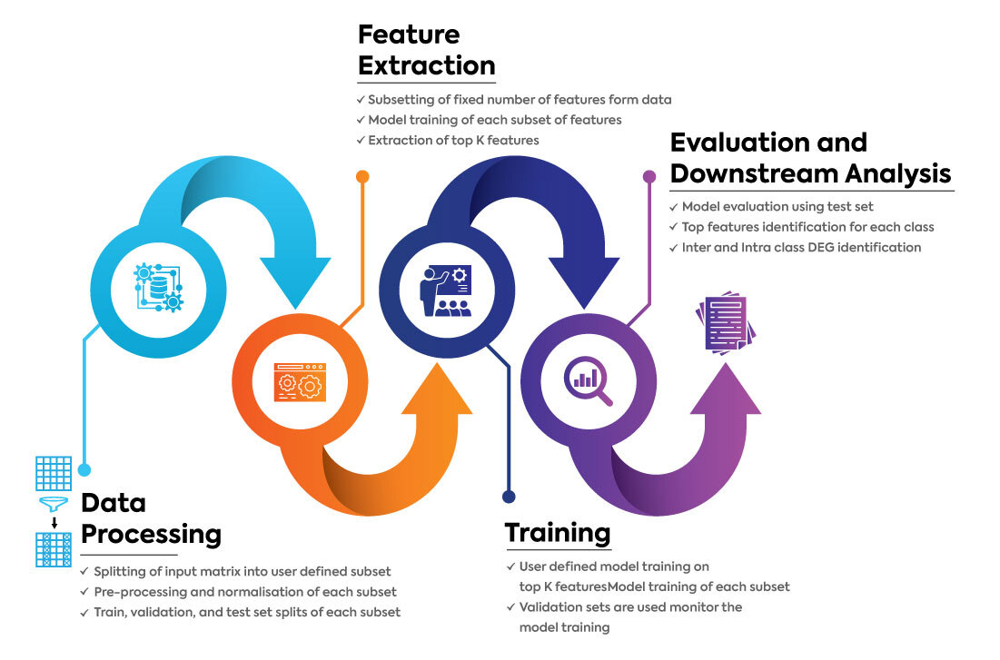

<left></left>

# Single-cell analysis using Low Resource (scaLR) 


[](https://github.com/infocusp/scaLR?tab=GPL-3.0-1-ov-file#)
[](https://infocusp.github.io/scaLR/)

[](https://doi.org/10.5281/zenodo.13767942)

## 📖 Overview 

<b>scaLR</b> is a comprehensive end-to-end pipeline that is equipped with a range of advanced features to streamline and enhance the analysis of scRNA-seq data. The major steps of the platform are:

1. <b>Data Processing</b>: Large datasets undergo preprocessing and [normalization](https://colab.research.google.com/github/infocusp/scaLR/blob/main/tutorials/preprocessing/normalization.ipynb) (if the user opts to) and are segmented into training, testing, and validation sets.

2. <b>Features Extraction</b>: A model is trained on feature subsets in a batch-wise process, so all features and samples are utilized in the feature selection process. Then, the top-k features are selected to train the final model, using a feature score based on the model's coefficients/weights or [SHAP analayis](https://colab.research.google.com/github/infocusp/scaLR/blob/main/tutorials/analysis/shap_analysis/shap_heatmap.ipynb). 

3. <b>Training</b>: A Deep Neural Network (DNN) is trained on the training dataset. The validation dataset is used to validate the model at each epoch, and early stopping is performed if applicable. Also, a [batch correction](https://colab.research.google.com/github/infocusp/scaLR/blob/main/tutorials/preprocessing/batch_correction.ipynb) method is available to correct batch effects during training in the pipeline.

4. <b>Evaluation & Downstream Analysis</b>: The trained model is evaluated using the test dataset by calculating metrics such as precision, recall, f1-score, and accuracy. Various visualizations, such as ROC curve of class annotation, feature rank plots, heatmap of top genes per class, [DGE analysis](https://colab.research.google.com/github/infocusp/scaLR/blob/main/tutorials/analysis/differential_gene_expression/dge.ipynb), and [gene recall curves](https://colab.research.google.com/github/infocusp/scaLR/blob/main/tutorials/analysis/gene_recall_curve/gene_recall_curve.ipynb), are generated.

The following flowchart explains the major steps of the scaLR platform.



## Pre-requisites and installation scaLR


- ScaLR can be installed using git or pip. It is tested in Python 3.10 and it is recommended to use that environment.


```
conda create -n scaLR_env python=3.10

conda activate scaLR_env
```

- Using git

```
git clone https://github.com/infocusp/scaLR.git

pip install -r requirements.txt
```
- Installation using pip
```
pip install pyscaLR
```
*Note* If the user wants to run the entire pipeline via installing pip pyscalr, they should clone/download these files(`pipeline.py` and `config.yaml`) from the git repository.

## Input Data
- Currently the pipeline expects all datasets in [anndata](https://anndata.readthedocs.io/en/latest/tutorials/notebooks/getting-started.html) formats (`.h5ad` files only).
- The anndata object should contain cell samples as `obs` and genes as `var. '
- `adata.X`: contains normalized gene counts/expression values (`log1p` normalization with range `0-10` expected).
- `adata.obs`: contains any metadata regarding cells, including a column for `target` which will be used for classification. The index of `adata.obs` is cell_barcodes.
- `adata.var`: contains all gene_names as an Index.

             
## How to run

1. It is necessary that the user modify the configuration file, and each stage of the pipeline is available inside the config folder [config.yml] as per your requirements. Simply omit/comment out stages of the pipeline you do not wish to run.
2. Refer config.yml & it's detailed config [README](https://github.com/infocusp/scaLR/blob/main/config/README.md) file on how to use different parameters and files.
3. Then use the `pipeline.py` file to run the entire pipeline according to your configurations. This file takes as argument the path to config (`-c | --config`), along with optional flags to log all parts of the pipelines (`-l | --log`) and to analyze memory usage (`-m | --memoryprofiler`).
5. `python pipeline.py --config /path/to/config.yaml -l -m` to run the scaLR.

## Examples configs

### Config edits (For clinical condition-specific biomarker identification and DGE analysis)

An example configuration file for the current dataset, incorporating the edits below, can be found at: scaLR/tutorials/pipeline/config_clinical.yaml.Please update the device as CUDA or CPU as per runtype

- Experiment Config
  - Make sure to change the exp_run number if you have an experiment with the same number earlier related to cell classification. As we have done one experiment earlier, we'll change the number now to '1'.
- Data Config
  - The full_datapath remains the same as above.
  - Change the target to disease (this column contains data for clinical conditions, COVID-19/normal).
- Feature Selection
  - Update the model layers to [5000, 2], as there are only two types of clinical conditions.
  - epoch as 10.
- Final Model Training
  -Update the model layers to the same as for feature selection: [5000, 2].
  - epoch as 100.
- Analysis
  - Downstream Analysis
     - Uncomment the full_samples_downstream_analysis section.
     - We are not performing the 'gene_recall_curve' analysis in this case. It can be performed if the COVID-19/normal specific genes are available, but there are many possibilities of genes in the case of normal conditions.
     - There are two options to perform differential gene expression (DGE) analysis: DgePseudoBulk and DgeLMEM. The parameters are updated as follows. Note that DgeLMEM may take a bit more time, as the multiprocessing is not very       efficient with only 2 CPUs in the current Colab runtime.
     - Please refer to the section below:

    ```
    analysis:
    
      model_checkpoint: ''
    
      dataloader:
          name: SimpleDataLoader
          params:
              batch_size: 15000
    
      gene_analysis:
          scoring_config:
              name: LinearScorer
    
          features_selector:
              name: ClasswisePromoters
              params:
                  k: 100
      full_samples_downstream_analysis:
          - name: Heatmap
            params:
              top_n_genes: 100
          - name: RocAucCurve
            params: {}
          - name: DgePseudoBulk
            params:
                celltype_column: 'cell_type'
                design_factor: 'disease'
                factor_categories: ['COVID-19', 'normal']
                sum_column: 'donor_id'
                cell_subsets: ['conventional dendritic cell', 'natural killer cell']
          - name: DgeLMEM
            params:
              fixed_effect_column: 'disease'
              fixed_effect_factors: ['COVID-19', 'normal']
              group: 'donor_id'
              celltype_column: 'cell_type'
              cell_subsets: ['conventional dendritic cell']
              gene_batch_size: 1000
              coef_threshold: 0.1
    ```
### Config edits (For clinical condition-specific biomarker identification and DGE analysis)
  An example configuration file for the current dataset, incorporating the edits below, can be found at: scaLR/tutorials/pipeline/config_clinical.yaml.Please update the device as cuda or cpu as per runtype

- Experiment Config
    - Make sure to change the exp_run number if you have an experiment with the same number earlier related to cell classification.As we have done one experiment earlier, we'll change the number now to '1'.
- Data Config
    - The full_datapath remains the same as above.
    - Change the target to disease (this column contains data for clinical conditions, COVID-19/normal).
- Feature Selection
    - Update the model layers to [5000, 2], as there are only two types of clinical conditions.
    - epoch as 10.
- Final Model Training
    - Update the model layers to the same as for feature selection: [5000, 2].
    - epoch as 100.
- Analysis
    - Downstream Analysis
      - Uncomment the full_samples_downstream_analysis section.
      - We are not performing the 'gene_recall_curve' analysis in this case. It can be performed if the COVID-19/normal specific genes are available, but there are many possibilities of genes in the case of normal conditions.
      - There are two options to perform differential gene expression (DGE) analysis: DgePseudoBulk and DgeLMEM. The parameters are updated as follows. Note that DgeLMEM may take a bit more time, as the multiprocessing is not very efficient with only 2 CPUs in the current Colab runtime.
      - Please refer to the section below:
    ```
    analysis:
    
      model_checkpoint: ''
    
      dataloader:
          name: SimpleDataLoader
          params:
              batch_size: 15000
    
      gene_analysis:
          scoring_config:
              name: LinearScorer
    
          features_selector:
              name: ClasswisePromoters
              params:
                  k: 100
      full_samples_downstream_analysis:
          - name: Heatmap
            params:
              top_n_genes: 100
          - name: RocAucCurve
            params: {}
          - name: DgePseudoBulk
            params:
                celltype_column: 'cell_type'
                design_factor: 'disease'
                factor_categories: ['COVID-19', 'normal']
                sum_column: 'donor_id'
                cell_subsets: ['conventional dendritic cell', 'natural killer cell']
          - name: DgeLMEM
            params:
              fixed_effect_column: 'disease'
              fixed_effect_factors: ['COVID-19', 'normal']
              group: 'donor_id'
              celltype_column: 'cell_type'
              cell_subsets: ['conventional dendritic cell']
              gene_batch_size: 1000
              coef_threshold: 0.1
    ```

## Interactive tutorials
Detailed tutorials have been made on how to use some functionalities as a scaLR library. Find the links below.

- **scaLR pipeline** [](https://colab.research.google.com/github/infocusp/scaLR/blob/main/tutorials/pipeline/scalr_pipeline.ipynb)
- **Differential gene expression analysis** [](https://colab.research.google.com/github/infocusp/scaLR/blob/main/tutorials/analysis/differential_gene_expression/dge.ipynb)
- **Gene recall curve** [](https://colab.research.google.com/github/infocusp/scaLR/blob/main/tutorials/analysis/gene_recall_curve/gene_recall_curve.ipynb)
- **Normalization** [](https://colab.research.google.com/github/infocusp/scaLR/blob/main/tutorials/preprocessing/normalization.ipynb)
- **Batch correction** [](https://colab.research.google.com/github/infocusp/scaLR/blob/main/tutorials/preprocessing/batch_correction.ipynb)
- **SHAP analysis** [](https://colab.research.google.com/github/infocusp/scaLR/blob/main/tutorials/analysis/shap_analysis/shap_heatmap.ipynb)

## Experiment Output Structure
- **pipeline.py**:
The main script that performs an end-to-end run.
    - `exp_dir`: root experiment directory for the storage of all step outputs of the platform specified in the config.
    - `config.yml`: copy of config file to reproduce the user-defined experiment.

- **data_ingestion**:
Reads the data and splits it into Train/Validation/Test sets for the pipeline. Then, it performs sample-wise normalization on the data.
    - `exp_dir`
        - `data`
            - `train_val_test_split.json`: contains sample indices for train/validation/test splits.
            - `label_mappings.json`: contains mappings of all metadata columns between labels and IDs.
            - `train_val_test_split`: directory containing the train, validation, and test samples and data files.

- **feature_extraction**:
Performs feature selection and extraction of new datasets containing a subset of features.
    - `exp_dir`
        - `feature_extraction`
            - `chunked_models`: contains weights of each model trained on feature subset data (refer to feature subsetting algorithm).
            - `feature_subset_data`: directory containing the new feature-subsetted train, val, and test samples anndatas.
            - `score_matrix.csv`: combined scores of all individual models for each feature and class. shape: n_classes X n_features.
            - `top_features.json`: a file containing a list of top features selected / to be subsetted from total features.

- **final_model_training**:
Trains a final model based on `train_datapath` and `val_datapath` in config.
    - `exp_dir`
        - `model`
            - `logs`: directory containing Tensorboard Logs for the training of the model.
            - `checkpoints`: directory containing model weights checkpointed at every interval specified in config.
            - `best_model`: the best model checkpoint contains information to use model for inference/resume training.
                - `model_config.yaml`: config file containing model parameters.
                - `mappings.json`: contains mapping of class_names to class_ids used by model during training.
                - `model.pt`: contains model weights.

- **eval_and_analysis**:
Performs evaluation of best model trained on user-defined metrics on the test set. Also performs various downstream tasks.
   - `exp_dir`
        - `analysis`
            - `classification_report.csv`: contains classification report showing Precision, Recall, F1, and accuracy metrics for each class on the test set.
            - `gene_analysis`
                - `score_matrix.csv`: score of the final model, for each feature and class. shape: n_classes X n_features.
                - `top_features.json`: a file containing a list of selected top features/biomarkers.
            - `test_samples/full_samples`
                -  `heatmaps`
                    - `class_name.svg`: heatmap for top genes of a particular class w.r.t those genes association in other classes. E.g., B.svg, C.svg, etc.
                - `roc_auc.svg`: contains ROC-AUC plot for all classes.
                - `gene_recall_curve.svg`: contains gene recall curve plots.
                - `gene_recall_curve_info.json`: contains reference genes list which are present in top_K ranked genes per class for each model.
                - `pseudobulk_dge_result`
                    - `pbkDGE_celltype_factor_categories_0_vs_factor_categories_1.csv`: contains Pseudobulk DGE results between selected factor categories for a celltype.
                    - `pbkDGE_celltype_factor_categories_0_vs_factor_categories_1.svg`: volcano plot of Log2Foldchange vs -log10(p-value) of genes.
                - `lmem_dge_result`
                    - `lmemDGE_celltype.csv`: contains LMEM DGE results between selected factor categories for a celltype.
                    - `lmemDGE_fixed_effect_factor_X.svg`: volcano plot of coefficient vs -log10(p-value) of genes.
  


## Citation

Jogani Saiyam, Anand Santosh Pol, Mayur Prajapati, Amit Samal, Kriti Bhatia, Jayendra Parmar, Urvik Patel, Falak Shah, Nisarg Vyas, and Saurabh Gupta. "scaLR: a low-resource deep neural network-based platform for single cell analysis and biomarker discovery." bioRxiv (2024): 2024-09.

