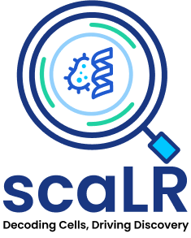

<center></center>

# Single-cell analysis using Low Resource (scaLR) 

<b>scaLR</b> is a comprehensive end-to-end pipeline that is equipped with a range of advanced features to streamline and enhance the analysis of scRNA-seq data. The major steps of the platform are:

1. Data processing: Large datasets undergo preprocessing and normalization (if the user opts to) and are segmented into training, testing, and validation sets.

2. Features extraction: A model is trained on feature subsets in a batch-wise process, so all features and samples are utilized in the feature selection process. Then, the top-k features are selected to train the final model, using a feature score based on the model's coefficients/weights.

3. Training: A Deep Neural Network (DNN) is trained on the training dataset. The validation dataset is used to validate the model at each epoch and early stopping is performed if applicable. Also, a batch correction method is available to correct batch effects during training in the pipeline.

4. Evaluation & Downstream analysis: The trained model is evaluated using the test dataset by calculating metrics such as precision, recall, f1-score, and accuracy. Various visualizations such as ROC curve of class annotation, feature rank plots, heatmap of top genes per class, DGE analysis, and gene recall curves are generated.

The following flowchart explains the major steps of the scaLR platform.


## Pre-requisites and installation scaLR


- ScalR can be installed using Conda or pip. It is tested in Python 3.9 and recommended to use that environment.

```
conda create -n scaLR_env python=3.9

```

-Clone the git repository and install the required packages by activating the conda env

```
conda activate scaLR_env

pip install -r requirements.txt

```

## Input Data
- Currently the pipeline expects all datasets in [anndata](https://anndata.readthedocs.io/en/latest/tutorials/notebooks/getting-started.html) formats (`.h5ad` files only)
- The anndata object should contain cell samples as `obs` and genes as `var`.
- `adata.X` contains all gene counts/expression values.
- `adata.obs` contains any metadata regarding cells, including a column for `target` which will be used for classification. The index of `adata.obs` is cell_barcodes.
- `adata.var` contains all gene_names as Index.


## Platform Scripts (Output Structure)
**pipeline.py**:
Main script to run the entire pipeline.
    - `exp_dir`: root experiment directory for storage of all phases of the pipeline. Specified from the config.
    - `config.yml`: copy of config file to reproduce the experiment

- **data_ingestion**:
Reads the data, and splits it into Train/Validation/Test sets for the pipeline. Then performs sample-wise normalization on the data
    - `exp_dir`
        - `data`
            - `train_val_test_split.json`: contains sample indices for train/validation/test splits
            - `label_mappings.json`: contains mappings of all metadata columns between labels and IDs
            - `train_val_test_split`: directory containing the train, validation, and test samples and data files.

- **feature_extraction**:
Performs feature selection and extraction of new datasets containing subset features
    - `exp_dir`
        - `feature_extraction`
            - `chunked_models`: contains weights of each model trained on feature subset data (refer to feature subsetting algorithm)
            - `feature_subset_data`: directory containing the new feature-subsetted train, val, and test samples anndatas
            - `score_matrix.csv`: combined scores of all individual models, for each feature and class. shape: n_classes X n_features
            - `top_features.json`: a file containing a list of top features selected / to be subsetted from total features.

- **final_model_training**:
Trains a final model based on `train_datapath` and `val_datapath` in config.
    - `exp_dir`
        - `model`
            - `logs`: directory containing Tensorboard Logs for the training of the model
            - `checkpoints`: directory containing model weights checkpointed at every interval specified in config.
            - `best_model`: The best model checkpoint contains information to use model for inference/resume training.
                - `config.yml`: config file containing model parameters
                - `label_mappings.json`: contains mapping of class_names to class_ids used by model during training
                - `model.pt`: contains model weights

- **eval_and_analysis**:
Performs evaluation of best model trained on user-defined metrics on the test set. Also performs various downstream tasks
   - `exp_dir`
        - `analysis`
            - `classification_report.csv`: Contains classification report showing Precision, Recall, F1, and accuracy metrics for each class, on the test set.
            - `gene_recall_curve.svg`: Contains gene recall curve plots.
            - `gene_recall_curve_info.json`: Contains reference genes list which are present in top_K ranked genes per class for each model.
            - `gene_analysis`
                - `score_matrix.csv`: score of the final model, for each feature and class. shape: n_classes X n_features
                - `top_features.json`: a file containing a list of selected top features/biomarkers
            -  `heatmaps`
                - `class_name.svg`: Heatmap for top genes of particular class w.r.t those genes association in other classes. E.g. B.svg, C.svg etc.
            - `roc_auc.svg`: Contains ROC-AUC plot for all classes.
            - `pseudobulk_dge_result`
                - `pbkDGE_celltype_factor_categories_0_vs_factor_categories_1.csv`
                - `pbkDGE_celltype_factor_categories_0_vs_factor_categories_1.svg`
            - `lmem_dge_result`
                - `lmem_DGE_celltype.csv`
                - `lmem_DGE_fixed_effect_factor_X.svg`
               
## How to run

1. It is necessary that the user modify the configuration file and each stage of the pipeline is available inside the config folder [config.yml] or [full_config.yml] as per your requirements. Simply omit/comment out stages of the pipeline you do not wish to run.
2. Refer config.yml & it's detailed config [README](config_README.md) file on how to use different parameters and files.
3. Then use the `pipeline.py` file to run the entire pipeline according to your configurations. This file takes as argument the path to config (`-c | --config`), and an optional flag to log all parts of the pipelines (`-l | --log`).
4. `python pipeline.py --config /path/to/config -c config.yaml -l` to run the scaLR.


## Interactive tutorials
Detailed tutorials have been made on how to use some functionalities as a scaLR library. Find the links below.

- Normalization - `tutorials/preprocessing/normalization.ipynb`
- Batch correction - `tutorials/preprocessing/batchc_correction.ipynb`
- Gene recall curve - `tutorials/analysis/gene_recall_curve/gene_recall_curve.ipynb`
- Differential gene expression analysis - `tutorials/analysis/differential_gene_expression/dge.ipynb`
- SHAP analysis - `tutorials/analysis/shap_analysis/shap_heatmap.ipynb`

<center >
  <b>scaLR © 2024 Infocusp Innovations</b>
</center>

<!-- ## Citation
Will update soon. -->

