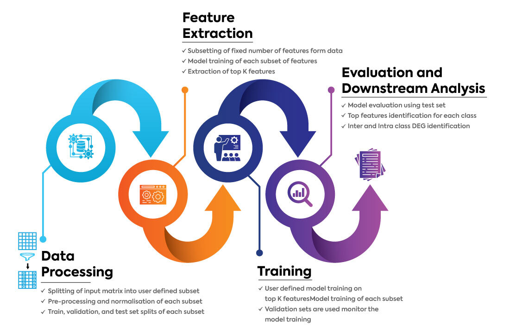

<left></left>

# Single-cell analysis using Low Resource (scaLR) 


[](https://github.com/infocusp/scaLR?tab=GPL-3.0-1-ov-file#)
[](https://infocusp.github.io/scaLR/)

[](https://doi.org/10.5281/zenodo.13767942)

## 📖 Overview 

<b>scaLR</b> is a comprehensive end-to-end pipeline that is equipped with a range of advanced features to streamline and enhance the analysis of scRNA-seq data. The major steps of the platform are:

1. <b>Data Processing</b>: Large datasets undergo preprocessing and [normalization](https://colab.research.google.com/github/infocusp/scaLR/blob/main/tutorials/preprocessing/normalization.ipynb) (if the user opts to) and are segmented into training, testing, and validation sets.

2. <b>Features Extraction</b>: A model is trained on feature subsets in a batch-wise process, so all features and samples are utilized in the feature selection process. Then, the top-k features are selected to train the final model, using a feature score based on the model's coefficients/weights or [SHAP analayis](https://colab.research.google.com/github/infocusp/scaLR/blob/main/tutorials/analysis/shap_analysis/shap_heatmap.ipynb). 

3. <b>Training</b>: A Deep Neural Network (DNN) is trained on the training dataset. The validation dataset is used to validate the model at each epoch, and early stopping is performed if applicable. Also, a [batch correction](https://colab.research.google.com/github/infocusp/scaLR/blob/main/tutorials/preprocessing/batch_correction.ipynb) method is available to correct batch effects during training in the pipeline.

4. <b>Evaluation & Downstream Analysis</b>: The trained model is evaluated using the test dataset by calculating metrics such as precision, recall, f1-score, and accuracy. Various visualizations, such as ROC curve of class annotation, feature rank plots, heatmap of top genes per class, [DGE analysis](https://colab.research.google.com/github/infocusp/scaLR/blob/main/tutorials/analysis/differential_gene_expression/dge.ipynb), and [gene recall curves](https://colab.research.google.com/github/infocusp/scaLR/blob/main/tutorials/analysis/gene_recall_curve/gene_recall_curve.ipynb), are generated.

**The below flowchart also explains the major steps of the scaLR platform.**



## Pre-requisites and installation scaLR


- ScaLR supports Python 3.10-3.14. Dependencies use compatible version ranges instead of requiring one exact Python environment. New Python releases still need to be added to CI before they can be considered supported.

```
conda create -n scaLR_env python=3.12

conda activate scaLR_env
```

You can use `venv` instead of Conda:

```
python3.12 -m venv .venv
source .venv/bin/activate
python -m pip install --upgrade pip
```

- Using git

```
git clone https://github.com/infocusp/scaLR.git
cd scaLR

python -m pip install --upgrade pip
python -m pip install -r requirements.txt
python -m pip install -e .
```
- Installation using pip
```
python -m pip install pyscaLR
```
If pip reports that no compatible dependency version is available, check `python --version` and upgrade pip. The package supports Python 3.10-3.14, but individual dependency releases may lag behind a newly released Python version.
**Note:** If the user wants to run the entire pipeline via installing pip pyscalr, they should clone/download these files(`pipeline.py` and `config.yaml`) from the git repository.

### CPU vs GPU installation

The base install (`pip install pyscaLR` or `pip install -r requirements.txt`) pulls the CPU build of PyTorch from PyPI and works out of the box on any machine, including ones without a GPU or CUDA toolkit.

If you have an NVIDIA GPU and want CUDA acceleration, install a CUDA-enabled `torch` build for your CUDA version **before or after** installing scaLR, following the [official PyTorch instructions](https://pytorch.org/get-started/locally/), e.g.:

```
pip install torch --index-url https://download.pytorch.org/whl/cu121
```

scaLR auto-selects the device (`device="auto"`) at train/inference time, using CUDA when available and otherwise falling back to CPU.

## Quickstart: annotate cells in 3 lines

```python
import scanpy as sc
import scalr

adata = sc.read_h5ad("pbmc.h5ad")

result = scalr.annotate(adata, model="models/pbmc_v1", device="auto")

adata.obs["cell_type"] = result.labels
adata.obs["cell_type_confidence"] = result.confidence
adata.obs["cell_type_unknown"] = result.is_unknown
```

To train your own model:

```python
model = scalr.train(adata, labels_key="cell_type", group_key="donor_id")
model.save("models/pbmc_v1")
```

`scalr.train` performs leakage-safe (donor-grouped) splitting, class-imbalance-aware training, confidence calibration, and reports macro-F1/balanced accuracy on held-out data. `scalr.annotate`/`model.predict` validate the input, align its genes to the model's expected feature set, and return a `PredictionResult` with calibrated `confidence`, `entropy`, `margin` and an `is_unknown` abstention flag — see [scalr/api.py](scalr/api.py) and [scalr/result.py](scalr/result.py). This sits alongside, and does not replace, the configuration-driven pipeline described below, which remains available for advanced/research workflows.

### Validate your data before training or annotating

```python
report = scalr.validate(adata, labels_key="cell_type", group_key="donor_id")
print(report)
```

`scalr.validate` (see [scalr/validation.py](scalr/validation.py)) checks AnnData structure (empty/duplicate cells or genes), numerical issues (NaN/Inf, zero-count or unusually large-library-size cells), label/group columns, and reports the detected normalization state (raw counts, log1p-normalized, or scaled) — surfacing problems as an explicit report instead of a downstream stack trace.

### Gene alignment

Query data does not need to share the model's gene set or gene order. `model.predict`/`scalr.annotate` call [scalr/genes.py](scalr/genes.py) internally to reorder/subset the query to the model's expected feature list, zero-filling any missing genes and reporting coverage (`result.metadata["gene_coverage"]`, `result.metadata["missing_features"]`). You can also run this alignment directly:

```python
aligned_adata, report = scalr.align_genes(adata, reference_features, min_feature_overlap=0.1)
print(report)
```

### Self-contained model artifacts

`model.save("models/pbmc_v1")` writes a versioned, portable directory containing everything needed to reload and run the model — no external config required: `manifest.json`, `model.pt`, `model_config.json`, `label_mapping.json`, `features.json`, `preprocessing.json`, `calibration.json`, and `metrics.json`. `scalr.load_model("models/pbmc_v1")` reads it back into an `AnnotationModel` — see [scalr/artifact.py](scalr/artifact.py).

### Leakage-safe evaluation & class imbalance

When `group_key` (e.g. `donor_id`) is passed to `scalr.train`, splitting keeps every group confined to a single split and checks for leakage across splits, warning if any group value still appears in more than one ([scalr/leakage.py](scalr/leakage.py)). Training also reports class-size imbalance and uses inverse-frequency class weighting by default, and evaluates on the held-out test split with macro-F1, weighted-F1, balanced accuracy and a per-class report rather than relying on overall accuracy alone ([scalr/metrics.py](scalr/metrics.py)).

### Hierarchical (coarse-to-fine) annotation

Pass a `taxonomy` mapping every fine-grained label to a broad label at training time, then request either level at inference time — without retraining:

```python
taxonomy = {"CD4_T": "T_cell", "CD8_T": "T_cell", "B_cell": "B_cell", "DC": "Myeloid"}
model = scalr.train(adata, labels_key="cell_type", group_key="donor_id", taxonomy=taxonomy)

fine_result = model.predict(adata, level="fine")     # default
broad_result = model.predict(adata, level="broad")   # aggregated via the taxonomy
```

See [scalr/hierarchy.py](scalr/hierarchy.py); broad-class probabilities are the sum of the underlying fine-class probabilities.

### Cluster-aware refinement & doublet/mixed-cell screening

```python
result = scalr.annotate(
    adata,
    model="models/pbmc_v1",
    cluster_refinement="auto",  # or an adata.obs column name
    flag_doublets=True,
)
```

`cluster_refinement` relabels cells to their cluster's confidence-weighted majority class ([scalr/refinement.py](scalr/refinement.py)) — the raw, unrefined labels are always kept in `result.metadata["raw_labels"]`, never silently discarded. `flag_doublets` sets `result.is_possible_doublet` for cells whose top-two class probabilities are both substantial and close together ([scalr/doublet.py](scalr/doublet.py)) — a heuristic screening signal, not a validated doublet call.

### Feature-selection stability

```python
report = scalr.compute_feature_stability(adata, labels_key="cell_type", top_k=50, n_runs=20)
print(report)
print(report.top_stable_features(min_runs=15))
```

Repeats feature selection over random subsamples and reports each gene's selection frequency plus the mean pairwise Jaccard similarity of the selected sets, to help distinguish a stable biomarker signal from a split-specific artifact ([scalr/feature_stability.py](scalr/feature_stability.py)).

### Model cards, provenance & a local model registry

Every `model.save(...)` call also writes a `README.md` model card (training data, held-out metrics, calibration, known limitations, license) into the artifact directory ([scalr/model_card.py](scalr/model_card.py)). Models can be registered and resolved by name via a local registry ([scalr/models.py](scalr/models.py)), the starting point for a future hosted model hub:

```python
scalr.models.register("models/pbmc_v1", "human_pbmc")
scalr.models.list()          # -> ['human_pbmc']
scalr.models.info("human_pbmc")

model = scalr.load_model("human_pbmc")   # resolves the registered name
```

### Benchmark suite

```python
df = scalr.run_benchmark(
    {"small": small_adata, "medium": medium_adata},
    labels_key="cell_type",
    group_key="donor_id",
)
```

Reports scientific quality (macro-F1, balanced accuracy) alongside computational cost (wall time, cells/sec, peak RSS) per dataset in one table, so quality and resource cost are always reported together rather than a one-off number ([scalr/benchmark.py](scalr/benchmark.py)).

## Command-line interface

The simple API is also available from the shell as the `scalr` command. This is separate from, and does not replace, `python pipeline.py --config ...` (see "How to run" below for the configuration-driven pipeline); `scalr` wraps the in-memory simple API — see [scalr/cli.py](scalr/cli.py).

### 1. Install (registers the `scalr` command)

```bash
pip install -r requirements.txt
pip install -e .          # or: pip install pyscaLR
```

`pip install -e .` (or the packaged `pyscaLR`) registers the `scalr` console script via `[project.scripts]` in `pyproject.toml`. Verify it's on your `PATH`:

```bash
scalr --help
```

### 2. Validate your data first

```bash
scalr validate --input data.h5ad --labels-key cell_type --group-key donor_id
```

Prints the validation report (structure/numerical/label checks) and exits non-zero if the data is unusable — useful as a pre-flight check or CI gate.

### 3. Train a model

```bash
scalr train \
  --input train.h5ad \
  --labels-key cell_type \
  --group-key donor_id \
  --output models/pbmc_v1 \
  --epochs 15 \
  --device auto
```

Writes a self-contained model artifact directory to `models/pbmc_v1` (weights, manifest, calibration, a `README.md` model card, etc.) and prints macro-F1/balanced accuracy on the held-out split.

### 4. Annotate new data with it

```bash
scalr annotate \
  --input query.h5ad \
  --model models/pbmc_v1 \
  --output annotated.h5ad \
  --device auto \
  --flag-doublets
```

Writes predictions (`scalr_pred`, `scalr_confidence`, `scalr_unknown`, etc.) into `annotated.h5ad`'s `.obs`/`.obsm`/`.uns`. `--model` also accepts a name registered in the local model registry, not just a path.

### 5. Evaluate against labeled test data

```bash
scalr evaluate --input test.h5ad --model models/pbmc_v1 --labels-key cell_type
```

Prints macro-F1/weighted-F1/balanced-accuracy plus a per-class precision/recall/F1 table.

### 6. Manage the local model registry

```bash
scalr models list
scalr models info human_pbmc
```

Registering a model into the registry (`scalr.models.register(...)`) is currently Python-API-only, not yet a CLI subcommand.

### 7. Run downstream analyses

Configure the desired analyses under `analysis` in a YAML file. Supported analyses include `Heatmap`, `RocAucCurve`, `GeneRecallCurve`, `DgePseudoBulk`, and `DgeLMEM`.

Run them through the CLI:

```bash
scalr analyze \
    --config config/config.yaml \
    --log
```

Optional flags:

```bash
--level INFO
--logpath scalr_experiments/analysis.log
--memoryprofiler
```

The command uses the existing configuration-driven pipeline and writes results under the `experiment.dirpath` configured in the YAML file.

## Input data format
- Currently the pipeline expects all datasets in [anndata](https://anndata.readthedocs.io/en/latest/tutorials/notebooks/getting-started.html) formats (`.h5ad` files only).
- The anndata object should contain cell samples as `obs` and genes as `var. '
- `adata.X`: contains normalized gene counts/expression values (`log1p` normalization with range `0-10` expected).
- `adata.obs`: contains any metadata regarding cells, including a column for `target` which will be used for classification. The index of `adata.obs` is cell_barcodes.
- `adata.var`: contains all gene_names as an Index.

             
## How to run

1. It is necessary that the user modify the configuration file, and each stage of the pipeline is available inside the config folder [config.yml] as per your requirements. Simply omit/comment out stages of the pipeline you do not wish to run.
2. Refer **config.yml** & **it's detailed config** [README](https://github.com/infocusp/scaLR/blob/main/config/README.md) file on how to use different parameters and files.
3. Then use the `pipeline.py` file to run the entire pipeline according to your configurations. This file takes as argument the path to config (`-c | --config`), along with optional flags to log all parts of the pipelines (`-l | --log`) and to analyze memory usage (`-m | --memoryprofiler`).
5. `python pipeline.py --config /path/to/config.yaml -l -m` to run the scaLR.

## Example configs

### Config for cell type classification and biomarker identification

NOTE: Below are just suggestions for the model parameters. Feel free to play around with them for tuning the model & improving the results.

An example configuration file for the current dataset, incorporating the edits below, can be found at '`scaLR/tutorials/pipeline/config_celltype.yaml`. Update the device as cuda or cpu as per the requirement.

- **Device setup*** 
    - Update device: 'cuda' for GPU enabled runtype, else device: 'cpu' for CPU enabled runtype.
- **Experiment Config**
    - The default exp_run number is 0.If not changed, the celltype classification experiment would be exp_run_0 with all the pipeline results.
- **Data Config**
    - Update the full_datapath to `data/modified_adata.h5ad` (as we will include GeneRecallCurve in the downstream).
    - Specify the num_workers value for effective parallelization.
    - Set target to cell_type.
- **Feature Selection**
    - Specify the num_workers value for effective parallelization.
    - Update the model layers to [5000, 10], as there are only 10 cell types in the dataset.
    - Change epoch to 10.
- **Final Model Training**
    - Update the model layers to the same as for feature selection: [5000, 10].
    - Change epoch to 100.
- **Analysis**
    - Downstream Analysis
        - Uncomment the test_samples_downstream_analysis section.
        -   Update the reference_genes_path to `scaLR/tutorials/pipeline/grc_reference_gene.csv`.
        - Refer to the section below:
    ```
    # Config file for pipeline run for cell type classification.

    # DEVICE SETUP.
    device: 'cuda'

    # EXPERIMENT.
    experiment:
        dirpath: 'scalr_experiments'
        exp_name: 'exp_name'
        exp_run: 0

    # DATA CONFIG.
    data:
        sample_chunksize: 20000

        train_val_test:
            full_datapath: 'data/modified_adata.h5ad'
            num_workers: 2

            splitter_config:
                name: GroupSplitter
                params:
                    split_ratio: [7, 1, 2.5]
                    stratify: 'donor_id'

            # split_datapaths: ''

        # preprocess:
        #     - name: SampleNorm
        #       params:
        #             **args

        #     - name: StandardScaler
        #       params: 
        #             **args

        target: cell_type    

    # FEATURE SELECTION.
    feature_selection:

        # score_matrix: '/path/to/matrix'
        feature_subsetsize: 5000
        num_workers: 2

        model:
            name: SequentialModel
            params:
                layers: [5000, 10]
                weights_init_zero: True

        model_train_config:
            trainer: SimpleModelTrainer

            dataloader: 
                name: SimpleDataLoader
                params:
                    batch_size: 25000
                    padding: 5000
            
            optimizer:
                name: SGD
                params:
                    lr: 1.0e-3
                    weight_decay: 0.1

            loss:
                name: CrossEntropyLoss
            
            epochs: 10

        scoring_config: 
            name: LinearScorer
            
        features_selector:
            name: AbsMean
            params:
                k: 5000

    # FINAL MODEL TRAINING.
    final_training:

        model:
            name: SequentialModel
            params:
                layers: [5000, 10]
                dropout: 0
                weights_init_zero: False

        model_train_config:
            resume_from_checkpoint: null

            trainer: SimpleModelTrainer

            dataloader: 
                name: SimpleDataLoader
                params:
                    batch_size: 15000
            
            optimizer:
                name: Adam
                params:
                    lr: 1.0e-3
                    weight_decay: 0

            loss:
                name: CrossEntropyLoss
            
            epochs: 100

            callbacks:
                - name: TensorboardLogger
                - name: EarlyStopping
                params:
                    patience: 3
                    min_delta: 1.0e-4
                - name: ModelCheckpoint
                params:
                    interval: 5
    analysis:

        model_checkpoint: ''

        dataloader:
            name: SimpleDataLoader
            params:
                batch_size: 15000

        gene_analysis:
            scoring_config:
                name: LinearScorer

            features_selector:
                name: ClasswisePromoters
                params:
                    k: 100
        test_samples_downstream_analysis:
            - name: GeneRecallCurve
              params:
                reference_genes_path: 'scaLR/tutorials/pipeline/grc_reference_gene.csv'
                top_K: 300
                plots_per_row: 3
                features_selector:
                    name: ClasswiseAbs
                    params: {}
            - name: Heatmap
              params: {}
            - name: RocAucCurve
              params: {}
    ```
### Config for clinical condition-specific biomarker identification and DGE analysis

An example configuration file (`scaLR/tutorials/pipeline/config_clinical.yaml`). Update the device as CUDA or CPU as per the requirement.

- Experiment Config
  - Make sure to change the exp_run number if you have an experiment with the same number earlier related to cell classification. As we have done one experiment earlier, we'll change the number now to '1'.
- Data Config
  - The full_datapath remains the same as above.
  - Change the target to disease (this column contains data for clinical conditions, COVID-19/normal).
- Feature Selection
  - Update the model layers to [5000, 2], as there are only two types of clinical conditions.
  - epoch as 10.
- Final Model Training
  -Update the model layers to the same as for feature selection: [5000, 2].
  - epoch as 100.
- Analysis
  - Downstream Analysis
     - Uncomment the full_samples_downstream_analysis section for example config file.
     - We are not performing the 'gene_recall_curve' analysis in this case. It can be performed if the COVID-19/normal specific genes are available, but there are many possibilities of genes in the case of normal conditions.
     - There are two options to perform differential gene expression (DGE) analysis: **DgePseudoBulk and DgeLMEM**. The parameters are updated as follows. Note that DgeLMEM may take a bit more time, as the multiprocessing is not very efficient with only 2 CPUs in the current Colab runtime.
     - Refer to the section below:

    ```
    analysis:
    
      model_checkpoint: ''
    
      dataloader:
          name: SimpleDataLoader
          params:
              batch_size: 15000
    
      gene_analysis:
          scoring_config:
              name: LinearScorer
    
          features_selector:
              name: ClasswisePromoters
              params:
                  k: 100
      full_samples_downstream_analysis:
          - name: Heatmap
            params:
              top_n_genes: 100
          - name: RocAucCurve
            params: {}
          - name: DgePseudoBulk
            params:
                celltype_column: 'cell_type'
                design_factor: 'disease'
                factor_categories: ['COVID-19', 'normal']
                sum_column: 'donor_id'
                cell_subsets: ['conventional dendritic cell', 'natural killer cell']
          - name: DgeLMEM
            params:
              fixed_effect_column: 'disease'
              fixed_effect_factors: ['COVID-19', 'normal']
              group: 'donor_id'
              celltype_column: 'cell_type'
              cell_subsets: ['conventional dendritic cell']
              gene_batch_size: 1000
              coef_threshold: 0.1
    ```

## Interactive tutorials
Detailed tutorials have been made on how to use some pipeline functionalities as a scaLR library. Find the links below.

- **scaLR pipeline** [](https://colab.research.google.com/github/infocusp/scaLR/blob/main/tutorials/pipeline/scalr_pipeline.ipynb)
- **Differential gene expression analysis** [](https://colab.research.google.com/github/infocusp/scaLR/blob/main/tutorials/analysis/differential_gene_expression/dge.ipynb)
- **Gene recall curve** [](https://colab.research.google.com/github/infocusp/scaLR/blob/main/tutorials/analysis/gene_recall_curve/gene_recall_curve.ipynb)
- **Normalization** [](https://colab.research.google.com/github/infocusp/scaLR/blob/main/tutorials/preprocessing/normalization.ipynb)
- **Batch correction** [](https://colab.research.google.com/github/infocusp/scaLR/blob/main/tutorials/preprocessing/batch_correction.ipynb)

- **An example of jupyter notebook to [run scaLR in local machine](https://github.com/infocusp/scaLR/blob/main/tutorials/pipeline/scalr_pipeline_local_run.ipynb)**.

## Experiment output structure
- **pipeline.py**:
The main script that performs an end-to-end run.
    - `exp_dir`: root experiment directory for the storage of all step outputs of the platform specified in the config.
    - `config.yml`: copy of config file to reproduce the user-defined experiment.

- **data_ingestion**:
Reads the data and splits it into Train/Validation/Test sets for the pipeline. Then, it performs sample-wise normalization on the data.
    - `exp_dir`
        - `data`
            - `train_val_test_split.json`: contains sample indices for train/validation/test splits.
            - `label_mappings.json`: contains mappings of all metadata columns between labels and IDs.
            - `train_val_test_split`: directory containing the train, validation, and test samples and data files.

- **feature_extraction**:
Performs feature selection and extraction of new datasets containing a subset of features.
    - `exp_dir`
        - `feature_extraction`
            - `chunked_models`: contains weights of each model trained on feature subset data (refer to feature subsetting algorithm).
            - `feature_subset_data`: directory containing the new feature-subsetted train, val, and test samples anndatas.
            - `score_matrix.csv`: combined scores of all individual models for each feature and class. shape: n_classes X n_features.
            - `top_features.json`: a file containing a list of top features selected / to be subsetted from total features.

- **final_model_training**:
Trains a final model based on `train_datapath` and `val_datapath` in config.
    - `exp_dir`
        - `model`
            - `logs`: directory containing Tensorboard Logs for the training of the model.
            - `checkpoints`: directory containing model weights checkpointed at every interval specified in config.
            - `best_model`: the best model checkpoint contains information to use model for inference/resume training.
                - `model_config.yaml`: config file containing model parameters.
                - `mappings.json`: contains mapping of class_names to class_ids used by model during training.
                - `model.pt`: contains model weights.

- **eval_and_analysis**:
Performs evaluation of best model trained on user-defined metrics on the test set. Also performs various downstream tasks.
   - `exp_dir`
        - `analysis`
            - `classification_report.csv`: contains classification report showing Precision, Recall, F1, and accuracy metrics for each class on the test set.
            - `gene_analysis`
                - `score_matrix.csv`: score of the final model, for each feature and class. shape: n_classes X n_features.
                - `top_features.json`: a file containing a list of selected top features/biomarkers.
            - `test_samples/full_samples`
                -  `heatmaps`
                    - `class_name.svg`: heatmap for top genes of a particular class w.r.t those genes association in other classes. E.g., B.svg, C.svg, etc.
                - `roc_auc.svg`: contains ROC-AUC plot for all classes.
                - `gene_recall_curve.svg`: contains gene recall curve plots.
                - `gene_recall_curve_info.json`: contains reference genes list which are present in top_K ranked genes per class for each model.
                - `pseudobulk_dge_result`
                    - `pbkDGE_celltype_factor_categories_0_vs_factor_categories_1.csv`: contains Pseudobulk DGE results between selected factor categories for a celltype.
                    - `pbkDGE_celltype_factor_categories_0_vs_factor_categories_1.svg`: volcano plot of Log2Foldchange vs -log10(p-value) of genes.
                - `lmem_dge_result`
                    - `lmemDGE_celltype.csv`: contains LMEM DGE results between selected factor categories for a celltype.
                    - `lmemDGE_fixed_effect_factor_X.svg`: volcano plot of coefficient vs -log10(p-value) of genes.
  
## Citation

Jogani, S., Pol, A. S., Prajapati, M., Samal, A., Bhatia, K., Parmar, J., ... & Gupta, S. (2025). scaLR: a low-resource deep neural network-based platform for single cell analysis and biomarker discovery. Briefings in Bioinformatics, 26(3), bbaf243.
